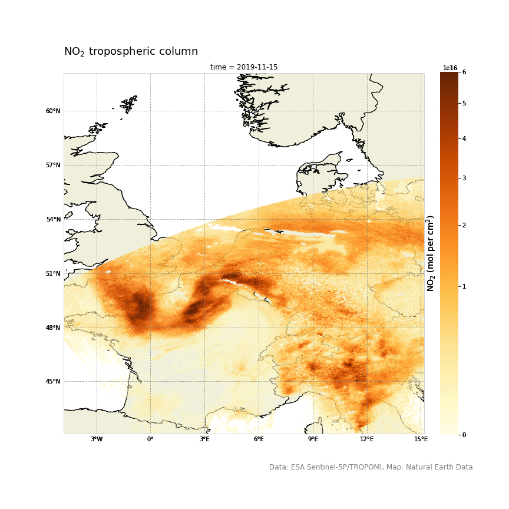

# DeltaNOx

In this project we provide improved spatial-temporal information on Nox levels at every location of the Netherlands by translating satellite-based pollution data to ground-level values. NO2 has been monitored by satellites since 1995 with GOME, since 2002 with SCIAMACHY, and since 2004 with the OMI instrument. These instruments had the disadvantage of a low spatial resolution. The newest satellite, Sentinel 5p, that is in charge to monitor atmosphere conditions, was launched in October 2017. It has a 6 times higher spatial resolution than is predecessor. This makes it possible to come up with a lot of new information on the NO2 levels in the Netherlands. We verify the processed data with ground-sensor data from the Pandora spectrometers and compare it with the data that the RIVM provides.

